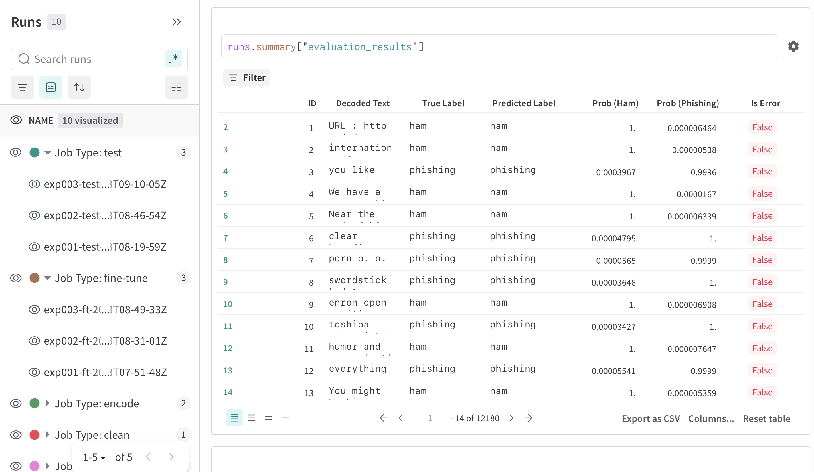
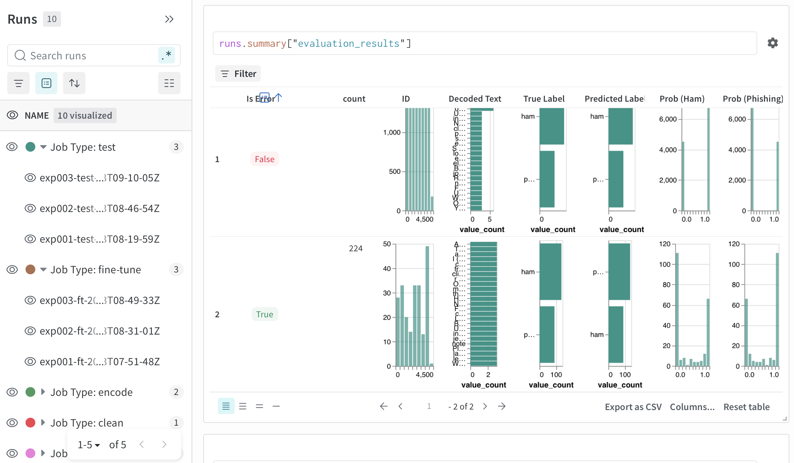
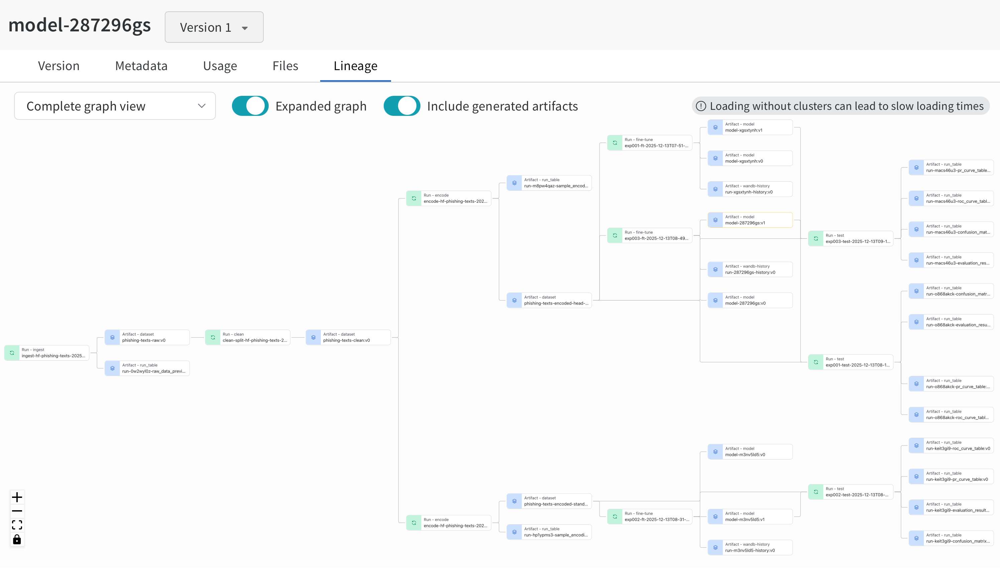

# wandb-experiments

A collection of ML experiments tracked with Weights & Biases.

---

## Why use Weights & Biases?

*Because `model_v2_final_fixed_REAL.pt` is not an experiment tracking strategy.*

W&B's main power is realized when you organize things properly. At the end of the day, it's just another tool. Misuse leads to chaos; thoughtful use leads to reproducibility and sanity.

### Philosophy: log everything, organize relentlessly

It's very powerful to log as much as you can to W&B. In MLOps, **metadata is extremely cheap** (kilobytes of JSON), while **compute and human suffering are very expensive**.

- Metadata is "free": Your dataset might be 500MB. The metadata you're calculating (word counts, versions, config) is likely less than 5KB. It adds zero storage overhead and negligible computation time compared to the model training that follows.
- UI clutter is manageable: It's better to have data hidden in the dashboard than not have it at all. You can always filter; you can never conjure data you didn't log.

---

## Naming Conventions

Consistent naming is critical for navigating the W&B dashboard and understanding your lineage graph. Random auto-generated names obscure your pipeline's story: see the [Lineage and Traceability](#lineage-and-traceability) section for a visual example of how good naming makes a pipeline readable at a glance.

### General Rule

Prefer dashes (`-`) over underscores (`_`) as delimiters, except for metric names ([explained below](#metric-names)). For any identifier, keep it [under 128 characters](#artifact-names).

Why dashes? W&B has different naming constraints for different things (artifacts, metrics, tags, etc.). Rather than memorizing each, just use dashes everywhere. They work in ALL contexts.

### Run Names

| Context | Format | Example |
|---------|--------|---------|
| Experiments/Evaluations | `exp-{00X}-{job_type}-{timestamp}` | `exp-003-train-2025-12-13T07-30-22Z ` |
| Data Ops | `{job_type}-{more-info}-{dataset}` | `encode-head-tail-phishing-texts` |

Even though W&B stores start time, duration, and end time automatically (and you can sort/filter by these columns via one click), putting the timestamp in the run name allows you to run the same script multiple times without having the same name show up in the UI.
* You can either use `datetime.now(timezone.utc)` or `int(time.time())`, or even a random hash. It doesn't really matter as long as the resulting identifier is unique.

TL;DR: The goal is just to make runs easier to distinguish visually in the UI and avoid confusion when looking at the runs table.

### Groups

Group related runs together to see them as a unit in the dashboard:

- Experiments: group `train` and evaluation (`test`) runs → `exp-003`
- Data pipelines: group pipeline stages → `phishing-pipeline-v2`
- Distributed training: if you have multiple workers/processes, they can all share the same `group` to be visualized together

TL;DR: groups are for saying "these runs are all part of experiment X" so you can filter, aggregate, and reason about them together.

### Job Types

Keep `job_type` values **simple and consistent across your organization**:

| Category | Job Types |
|----------|-----------|
| **Training** | `pre-train`, `train`, `fine-tune` |
| **Evaluation** | `eval`, `test`, `inference` |
| **Data Ops** | `ingest`, `clean`, `encode`, `transform`, `split` |

Why does consistency matter? Picture this: four teammates, four runs, four *completely* different names for the exact same thing:

```python
# ❌ Bad - team uses different terms for the same thing
job_type="preprocessing"
job_type="data_prep"
job_type="clean-data"
job_type="etl"

# ✅ Good - consistent vocabulary
job_type="clean"
```

Now try filtering by `job_type`. Go ahead, I'll wait.

TL;DR: Pick a fixed vocabulary, document it, and stick to it. Your future self and teammates will thank you when filtering runs and tracing artifact lineage.

### Tags

Tags are freeform, mutable, and highly flexible. Use them to capture the **what/how/status/where/why** of a run. Some examples are below:

- What:
    - general: `nlp`, `cv`, `tabular`, `classification`, `regression`
    - data ops: `full-dataset` vs `sample-10k`, `english` vs `multilingual`, `pre-2023-data`
- How:
    - train: `pytorch`, `transformers`, `sklearn`, `distributed`
    - data ops: `soft-filtering`, `keep-emojis`, `cased` vs `uncased`, `bpe`, `wordpiece`, `vocab-30k`
- Status: `baseline`, `experiment`, `prod`, `deprecated`, `bug-fix`, `prod-candidate`, `dev`
- Where: `local-mac`, `sagemaker`, `lambda`, `colab`, `p4d.24xlarge`
- Why: `ablation`, `hyperparam-search`, `bug-fix`, `data-update`, `ticket-JIRA-123`, `pr-45`

### Artifact Names

- Use **relative artifact names** when referencing artifacts within the same project
- Use **fully qualified names** (`entity/project/artifact:version`) only when referencing artifacts from a different project
- Follow the same dash-delimited convention: `phishing-texts-encoded` regardless of artifact type for consistency
- **Note**: keep artifact names [under 128 characters](https://github.com/wandb/wandb/issues/10266)

### Metric Names

[Due to GraphQL limitations](https://docs.wandb.ai/models/track/log#metric-naming-constraints), metric names should technically match `/^[_a-zA-Z][_a-zA-Z0-9]*$/`. However, W&B has engineered workarounds allowing slashes, hyphens, and spaces.

**Recommended convention**: Use slash-separated namespaces for clarity:

```python
run.log({
    "train/loss": train_loss,
    "train/accuracy": train_acc,
    "eval/loss": eval_loss,
    "eval/f1": eval_f1,
    "eval/precision": eval_precision,
    "eval/recall": eval_recall,
})
```

The last value logged during a run becomes the entry in `run.summary`.

---

## Run Configuration Management

### The `params` / `meta` pattern

*Adopt a **nested run config** to explicitly separate things that change behavior (`params`) from contextual metadata (`meta`):

**Data ops example**:
```python
params = {
    # PARAMS: Hyperparameters and settings that affect behavior.
    # Things you set *before* the code runs.
    # Think: "If I wanted to change this behavior tomorrow without rewriting code, I would make this a variable."
    # Rule: If you have the code and the config, you should be able to reproduce the run exactly.
    # Team signal: "If it's inside params, don't touch it unless you want behavior to change."
    "hf_dataset_path": "David-Egea/phishing-texts",
    "hf_config_name": None,
    "hf_revision": "v3",
    "splits": {"train": 0.8, "val": 0.1, "test": 0.1},
    "max_length": 256,
    "encoder": "head_tail",
    "seed": 42,
    "output_artifact": "phishing-texts-encoded:v3",
}

meta = {
    # META: Static definitions, lineage context, and data contracts.
    # Describes the environment and output schema—not tunable.
    # Very helpful for other members of your team.
    "task": "binary phishing detection dataset",
    "labels": ["ham", "phishing"],
    "output_structure": "datasets.DatasetDict",
    "output_format": "hf_arrow_dir",
    # A new guy coming into the team can immediately tell
    # how to load the dataset.
    "recommended_loader": "datasets.load_from_disk",
    "license": "MIT",
}

config = {"params": params, "meta": meta}

with wandb.init(config=config, ...) as run:
    # Your main function logic goes here
    pass
```

**Why this works:**

| Stakeholder | Benefit |
|-------------|---------|
| **Maintainers** | Immediately obvious which values affect code logic (`params`) vs. notes for humans (`meta`) |
| **Code** | Clean argument passing via `**run.config["params"]` or explicit named parameters |
| **W&B Dashboard** | Handles nested configs beautifully (e.g., filter by `params.batch_size`) |

***NOTE**: This convention was adopted due to `wandb`-`transformers` integration. When using HF `Trainer` with `WandbCallback`, you're no longer the only one writing the config.
* It can happily overwrite your value as usually HF asserts dominance once training starts.
* It can heavily pollute your namespace.
    * Your carefully curated flat config will be buried under 40+ infrastructure parameters from HF.

### Pros (with HF)

**Intent vs defaults**
* `config.params['learning_rate']` - "I explicitly want the learning rate to be 1e-4."
* `config['learning_rate']` - What HF reports. You know that "The trainer actually ran with learning rate 1e-4."
* Following this, it makes it more auditable which values you actually set, and which were left as defaults.

#### Cons

* This adds 7 characters of noise in every single hyperparameter column in your Runs table and Parallel Coordinates charts, making them harder to scan quickly.
* Your sweep configuration YAML must match this nesting exactly.
* Filter and grouping friction - you strictly have to type `params.lr` for example in ("Show me runs where learning rate > 0.01").

### Config as a Contract

In MLOps, we follow the "Config as a Contract" principle:

> Use `run.config` to tell the code what to do. Don't let the code surprise the config.

- **Avoid setting `run.config` dynamically**, even for values that seem "fixed"
- Define all configuration **outside** the run logic
- Your script should look at the config to decide what to do; it should not decide by itself and surprise you
- This ensures **predictability and downstream compatibility**

---

## Logging Best Practices

### Basic Usage

W&B is minimally intrusive. Wrap your code in a context manager and log as you go:

```python
with wandb.init(
    project="my-project",
    name="exp-001-train-20241217T1430Z",
    group="exp-001",
    job_type="train",
    tags=["nlp", "transformers", "baseline"],
    config=config,
) as run:
    for epoch in range(num_epochs):
        train_loss = train_one_epoch(model, train_loader)
        eval_metrics = evaluate(model, val_loader)

        run.log({
            "train/loss": train_loss,
            "eval/loss": eval_metrics["loss"],
            "eval/f1": eval_metrics["f1"],
            "epoch": epoch,
        })

    # Log final model as artifact
    run.log_artifact(model_artifact)
```

### Metrics

- Log metrics with `run.log({"metric_name": value})`
    - You can log multiple key-value pairs in one go
- Use namespaced metric names: `train/loss`, `eval/f1`
- The **last logged value** becomes the summary metric shown in the dashboard table
- Log step-based metrics for training curves; log summary metrics for final results

### Artifacts

Artifacts are versioned outputs (datasets, models, predictions) that establish lineage:

```python
# Create and log a model artifact
model_artifact = wandb.Artifact(
    name="phishing-classifier",
    type="model",
    description="Fine-tuned BERT for phishing detection",
    metadata={
        "framework": "transformers",
        "base_model": "bert-base-uncased",
        "f1_score": 0.94,
    }
)
model_artifact.add_dir("./model_weights")
run.log_artifact(model_artifact)

# Declare input dependency for lineage
input_artifact = run.use_artifact("phishing-texts-encoded:v3")
```

**Note:** W&B does not automatically create a new artifact version if you only update the metadata and the underlying files have not changed.

### Artifact Metadata

Artifact metadata is a **powerful but often overlooked feature** in W&B. It's the difference between "here's a blob" and "here's a self-documenting, queryable asset."
* Tutorials often skip it, the "just make it work" examples don't model good metadata hygiene.
* You don't feel the absence of metadata until 3 months later when you're staring at `model:v17` and wondering what the heck dataset it was trained on.

**Tip**: Dump `run.config` and/or `run.summary` into artifact metadata: `metadata={**run.config, ...}`.

This seems redundant! The config and summary are already saved with the run, but it makes the artifact **self-contained**:
- 6 months later, you're browsing artifacts, not runs. The config is right there.
- If someone uses your artifact from another project, they see the config without navigating to your run.
- Downloaded artifacts carry their own documentation.
- In fact, [this is what the HF `WandbCallback` does anyway](https://github.com/huggingface/transformers/blob/v5.0.0rc1/src/transformers/integrations/integration_utils.py#L849).

The cost is a few KB of duplicated JSON. The benefit is never having to ask "wait, what config produced this?"

#### The Mental Model

> "I'm looking at this artifact in the W&B UI 6 months from now. What do I need to know about it **without downloading it**?"

Metadata answers questions like:
- What model produced this? What dataset was it trained on?
- How many samples? What's the class distribution?
- What preprocessing was applied? What's the schema?
- How do I load this? What are the label mappings?

#### What to Include

| Artifact Type | Essential Metadata |
|---------------|-------------------|
| **Dataset** | `num_samples`, `splits`, `class_distribution`, `schema`, `source`, `preprocessing_applied` |
| **Model** | `base_model`, `dataset` (artifact name), `id2label`, `label2id`, `best_metric`, `framework` |
| **Predictions** | `model` (artifact name), `dataset` (artifact name), `threshold`, `num_predictions` |

#### Model Artifact Example

For classification models, label mappings are critical—without them, your model outputs meaningless integers:

```python
model_artifact = wandb.Artifact(
    name="phishing-classifier",
    type="model",
    description="Fine-tuned DistilBERT for phishing detection",
    metadata={
        # Lineage: what produced this
        "base_model": "distilbert-base-uncased",
        "dataset": "phishing-texts-encoded:v3",  # artifact reference
        "run_id": run.id,                        # link back to training run

        # Label mappings: CRITICAL for inference
        "num_labels": 2,
        "id2label": {0: "ham", 1: "phishing"},   # model output → human label
        "label2id": {"ham": 0, "phishing": 1},   # human label → model input

        # Performance: why you'd choose this version
        "val_f1": 0.94,
        "val_accuracy": 0.96,

        # Reproducibility
        "framework": "transformers",
        "transformers_version": "4.36.0",
    }
)
```

#### Dataset Artifact Example

```python
dataset_artifact = wandb.Artifact(
    name="phishing-texts-encoded",
    type="dataset",
    description="Tokenized phishing detection dataset with head-tail truncation",
    metadata={
        # What's in it
        "num_samples": {"train": 16240, "val": 2030, "test": 2031},
        "class_distribution": {"ham": 0.62, "phishing": 0.38},
        "max_length": 256,

        # How it was made
        "source_dataset": "David-Egea/phishing-texts",
        "encoding_strategy": "head_tail",
        "tokenizer": "distilbert-base-uncased",

        # How to use it
        "format": "hf_arrow",
        "loader": "datasets.load_from_disk",
        "columns": ["input_ids", "attention_mask", "label"],
    }
)
```

#### JSON Safety

Metadata must be JSON-serializable. NumPy arrays, PyTorch tensors, and custom objects will fail silently or error. Always convert inline or create a function that sanitizes metadata values:

```python
# ❌ Will fail or behave unexpectedly
metadata = {"accuracy": np.float64(0.95)}

# ✅ Convert to native Python types
metadata = {"accuracy": float(np.float64(0.95))}

# For arrays/lists of numpy values
metadata = {"scores": [float(x) for x in ndarray]}
```

#### Updating Metadata

You can add metadata at creation time or update it later:

```python
# At creation
artifact = wandb.Artifact(name="my-data", type="dataset", metadata={"v": 1})

# After creation (before logging)
artifact.metadata["num_samples"] = len(dataset)
artifact.metadata.update(computed_stats)
```

### Tables

W&B Tables turn debugging from a guessing game into a database query. Unlike TensorBoard's static images, Tables let you log actual data that you can **interactively** sort, filter, and explore.

```python
# Log predictions table for error analysis
predictions_table = wandb.Table(
    columns=["text", "true_label", "predicted_label", "confidence"],
    data=[
        ["Click here to win!", "phishing", "phishing", 0.98],
        ["Meeting at 3pm", "ham", "ham", 0.95],
        # ... more rows
    ]
)
run.log({"predictions": predictions_table})
```

**Table capabilities:**
- Support primitive and numeric types, nested lists, dictionaries
- Support rich media types: images, audio, video, HTML, molecules
- **Interactive sorting, filtering, and grouping in the UI**
- **Note:** Default limit of 10,000 rows for optimal UI performance

**Use cases:**
- Log validation failures sorted by confidence to see where the model is most confused
- Log data processing results for quality auditing
- Log model evaluation results with per-sample breakdowns

Tables are a specialized [data type](https://docs.wandb.ai/models/ref/python/data-types) logged as an [artifact](https://docs.wandb.ai/models/artifacts) object.

#### Example: Error Analysis with Tables

Say you log an evaluation table during validation with the ff. columns for each prediction:



This table has 12,180 rows—one per validation sample. Each row shows:
- **Decoded Text**: The input text (truncated in the UI for readability)
- **True Label** / **Predicted Label**: Ground truth vs. model output
- **Prob (Ham)** / **Prob (Phishing)**: Model confidence scores
- **Is Error**: Boolean flag for misclassifications

From here, you can immediately:
- Sort by confidence to find high-confidence errors (the dangerous ones)
- Filter to `Is Error = True` to see only misclassifications
- Search the text to find patterns in failures (e.g., do short texts fail more?)

But the real power is **grouping**. Click "Group by" → `Is Error`:



Now W&B aggregates the data into two rows: correct predictions (`False`) and errors (`True`). For each group, you get automatic histograms of every column. Here's what the histograms reveal:

**Row 1 — 11956 correct predictions:**
- Prob (Ham) clustered at 1.0, Prob (Phishing) clustered at 0.0 → model is confident when it's right ✓

**Row 2 — 224 misclassifications:**
- Predicted Label is almost entirely "ham" → when the model is wrong, it predicts "ham"
- True Label shows a mix, but "phishing" is well-represented → phishing messages are slipping through as ham
- Prob (Ham) has a cluster near 1.0 → some errors are high-confidence, meaning the model is *confidently* letting phishing through

This model has a **false negative problem**; it's missing phishing and calling it ham. For a security application, that's a dangerous direction. You'd rather flag legitimate emails for review than let phishing slip through undetected.

This is what "debugging as a database query" means. You're not guessing which samples failed. You're actually slicing and aggregating thousands of predictions in seconds. All in the UI, no `matplolib` + `seaborn` shenanigans.

### System Metrics

W&B automatically logs system stats: GPU utilization, CPU usage, memory, disk I/O, network, and temperature.

> If a run crashes overnight, `wandb` tells me exactly where the GPU memory spiked or if the CPU bottlenecked the data loader. I don't have to `ssh` in and stare at `htop`.

This works out-of-the-box by default, no config required.

### Run Summary

`run.summary` holds the **final values** for a run, displayed as columns in the Runs table. Use it for at-a-glance comparison across runs.

#### How It Works

- The **last value** logged for each metric automatically becomes the summary value
- You can also set summary values directly: `run.summary["best_f1"] = 0.94`
- Summary values appear as sortable/filterable columns in the dashboard

#### When to Use Summary vs. Logged Metrics

| Use Case | Where to Put It |
|----------|-----------------|
| Training curve (loss over epochs) | `run.log()` — you want the full history |
| Best validation score | `run.summary` — just the final number |
| Dataset statistics | `run.summary` — single values, no history |
| Hyperparameters | `run.config` — not summary |

#### Data Ops Example

For data processing runs, log computed statistics to both `artifact.metadata` (see above) and `run.summary`:

```python
stats = {
    "num_samples": len(dataset),
    "num_phishing": int(sum(dataset["label"])),  # ensure JSON-safe
    "avg_text_length": float(np.mean([len(t) for t in dataset["text"]])),
}

# Artifact metadata: "What is this artifact?"
artifact.metadata.update(stats)

# Run summary: "What did this run produce?" (for the Runs table)
for key, value in stats.items():
    run.summary[key] = value
```

**Why both?** Artifact metadata lives with the artifact (queryable in Artifacts tab). Run summary lives with the run (visible in Runs table). Different views, same data—log to both for maximum discoverability.

---

## Lineage and Traceability

The ability to trace any model back to its source data is one of W&B's most powerful features.



**What this graph shows:**

1. One cleaned dataset → branched into two encoding strategies (standard truncation vs. head-tail truncation)
2. Each encoded dataset → used to fine-tune (2) separate models
3. Every arrow represents an explicit `run.use_artifact()` → `run.log_artifact()` relationship

**Why this matters:** When `model-head-tail:v2` outperforms `model-standard:v1`, I can trace back and see *exactly* which dataset version, encoding parameters, and preprocessing steps produced each. No guessing, no "which notebook did I run?"

### Establishing lineage

The fundamental approach is creating a **directed graph of dependencies**, where the output artifact of one step becomes the explicitly declared input artifact for the next.

Each pipeline step is an independent W&B run that:
1. Declares its input artifacts with `run.use_artifact()`
2. Logs its output as a new artifact with `run.log_artifact()`

```python
# Step 1: Data ingestion
with wandb.init(job_type="ingest", ...) as run:
    raw_data = download_data()
    artifact = wandb.Artifact("raw-data", type="dataset")
    artifact.add_dir("./data/raw")
    run.log_artifact(artifact)

# Step 2: Data cleaning (declares dependency on Step 1)
with wandb.init(job_type="clean", ...) as run:
    input_artifact = run.use_artifact("raw-data:latest")
    input_path = input_artifact.download()

    cleaned_data = clean(input_path)

    output_artifact = wandb.Artifact("cleaned-data", type="dataset")
    output_artifact.add_dir("./data/cleaned")
    run.log_artifact(output_artifact)

# Step 3: Tokenization + encoding (declares dependency on Step 2)
with wandb.init(job_type="encode", ...) as run:
    input_artifact = run.use_artifact("cleaned-data:latest")
    # ... and so on
```

### Benefits of Proper Lineage

| Benefit | Description |
|---------|-------------|
| **Full Traceability** | Any model trained on `tokenized-data:v2` can automatically trace its lineage back through `cleaned-data:v4` to `raw-data:v5` |
| **Reproducibility** | To reproduce any step, use the exact same input artifact version—guaranteed identical starting data |
| **Efficient Orchestration** | External orchestrators (Airflow, Kubeflow, Prefect) can trigger downstream jobs only when a new artifact version is logged |
| **Debugging** | When a model regresses, trace back to find which data or preprocessing change caused it |

---

## Integrations

### 🤗 HuggingFace Transformers

W&B has [deep integration](https://docs.wandb.ai/models/integrations/huggingface) with HuggingFace Transformers, automatically logging:

- **Configuration parameters**: All `TrainingArguments` hyperparameters, model configuration, and tokenizer settings
- **Training metrics**: Loss curves, learning rates, gradient norms, and training progress (logged as `train/loss`, `train/learning_rate`, `train/grad_norm`, etc.)
- **Evaluation metrics**: Validation/test losses and metrics when `eval_dataset` is provided (logged as `eval/loss`, `eval/f1`, `eval/precision`, `eval/recall`, `eval/accuracy`, etc.)
- **System performance**: GPU/CPU utilization, memory usage, temperature, and throughput metrics (`eval/runtime`, `eval/samples_per_second`, `eval/steps_per_second`)
- **Model checkpoints**: Best model or all checkpoints saved as W&B Artifacts (configurable via `WANDB_LOG_MODEL` environment variable)
- **Gradients and parameters**: Parameter distributions and gradient histograms (enabled via `WANDB_WATCH` environment variable, disabled by default)
- **Training progress**: Epoch progression, global step counts, and real-time training curves

#### Setup

1. Set the **environment variable** for model logging:
   ```bash
   # Logs model at end of training
   export WANDB_LOG_MODEL=end
   ```
   Or set it in code via `os.environ`.
   If this is not set, HuggingFace will save the best model to your disk, but will not log as an artifact to W&B.

2. `transformers.TrainingArguments` configuration:
   ```python
   from transformers import TrainingArguments, Trainer

   training_args = TrainingArguments(
       output_dir="./results",
       report_to=["wandb"], # required arg to enable the WandbCallback
       load_best_model_at_end=True,  # W&B saves best checkpoint to Artifacts
       # ... other args
   )
   ```
After these setup steps, W&B via the `WandbCallback` automatically logs all training progress, metrics, and artifacts without any additional code in your training loop.

#### Manual Initialization for Custom Naming

To use your own naming conventions, initialize W&B **before** instantiating `Trainer`:

```python
import os
import wandb
from transformers import Trainer, TrainingArguments

os.environ["WANDB_LOG_MODEL"] = "end"

# Initialize with custom naming FIRST
with wandb.init(
    project="phishing-detection",
    name="exp-001-fine-tune-20241217T1430Z",
    group="exp-001",
    job_type="fine-tune",
    tags=["bert", "phishing", "baseline"],
    config={"params": params, "meta": meta},
) as run:
    # Trainer sees active run and logs to it
    training_args = TrainingArguments(
        output_dir="./results",
        report_to=["wandb"],
        # ... other args
    )
    trainer = Trainer(
        model=model,
        args=training_args,
        # ...
    )
    trainer.train()

# context manager automatically calls run.finish() after last line in block
```

**Important notes:**
- When `Trainer` starts, it detects the active run and logs to it (merging its own config)
- `Trainer` may overwrite some configs you declared—a reason to use the `params`/`meta` pattern to keep your values namespaced
- Manual initialization (`wandb.init()`) takes precedence over environment variables like `WANDB_PROJECT`

---

## Programmatic Access

You can export any data from W&B for programmatic analysis using the public API:

```python
import wandb

api = wandb.Api()

# Fetch a specific run
run = api.run("entity/project/run_id")
print(run.config)
print(run.summary)

# Query runs
runs = api.runs("entity/project", filters={"config.params.encoder": "head_tail"})
for run in runs:
    print(f"{run.name}: {run.summary.get('eval/f1', 'N/A')}")

# Download artifacts
# It's possible to get artifacts outside of a run context
artifact = api.artifact("entity/project/artifact-name:v3")
artifact.download()

# You can even get which run logged a particular artifact
creating_run = artifact.logged_by()

```
More info in:
* https://docs.wandb.ai/models/ref/python/experiments/artifact
* https://docs.wandb.ai/models/ref/python/experiments/run

---

## Pros & Cons of `wandb`

### Pros

| Advantage | Details |
|-----------|---------|
| **Minimal intrusion** | Just wrap code in `wandb.init()` context manager and call `run.log()` and provide proper run `config` |
| **Developer-first UX** | **Intuitive API**, **excellent documentation** (both are chef's kiss), fast iteration |
| **Automatic system monitoring** | GPU, CPU, memory, disk, network—no setup required |
| **Rich media logging** | Tables, images, audio, video, 3D objects, molecules |
| **Full lineage tracking** | Trace any model back to its source data |
| **Interactive tables** | Turn debugging from guesswork into database queries |
| **Strong integrations** | HuggingFace, PyTorch Lightning, Keras, scikit-learn, and more |
| **Collaboration features (a big one)** | Reports, team dashboards, artifact sharing, Registry |
| **Programmatic API** | Export everything for custom analysis |

### Cons

| Limitation | Details |
|------------|---------|
| **Cost** | Free tier is limited; team/enterprise pricing can be significant for heavy usage |
| **No native pipeline orchestration** | W&B tracks experiments but doesn't orchestrate them—you need Airflow, Kubeflow, Prefect, etc. for DAG execution |
| **Vendor lock-in** | Heavy reliance on W&B-specific APIs; migration requires effort |
| **Learning curve for advanced features** | Sweeps, artifacts, and reports have their own paradigms to learn |
| **Internet dependency** | Requires network access for logging (offline sync available but adds friction) |

---

## Quick Reference

### Minimal Example

```python
import wandb
import time

project_name = 'foo-project'
group_name = 'exp-001'
job_type = 'train'

raw_config = {
    "params": {"learning_rate": 1e-4, "batch_size": 32, "epochs": 10},
    "meta": {"task": "classification", "model": "bert-base"},
}

with wandb.init(
    project=project_name,
    # add a timestamp or keep it random.
    name=f"{group_name}-run-{int(time.time())}",
    group=group_name,
    job_type=job_type,
    config=raw_config,
    # PRO TIP: W&B can save the code from the file that called wandb.init()
    save_code=True,
) as run:

    # Just a reminder for Sweep safety: access values from 'run.config', not 'raw_config'
    # This ensures if W&B sweeps override 'learning_rate', you use the new value.
    epochs = run.config['params']['epochs']

    # Set the X-axis explicitly
    # This ensures your charts default to "Epoch" on the x-axis, not "Step"
    # Though HuggingFace Trainer already does this for you
    # if you set the strategy to either 'step' or 'epoch'
    run.define_metric("epoch")
    run.define_metric("train/*", step_metric="epoch")
    run.define_metric("eval/*", step_metric="epoch")

    # Example loop
    for epoch in range(epochs):
        # ... perform training ...
        loss = 0.5  # placeholder

        # log accepts multiple key value pairs
        run.log({
            "train/loss": loss,
            "epoch": epoch
        })

    print(f"🤗 Training complete!")

# Context manager automatically calls run.finish()
```

### Checklist for new Runs

**Run setup:**
- [ ] Set meaningful `name` following convention
- [ ] Set `group` for related runs
- [ ] Set `job_type` from standard vocabulary
- [ ] Add relevant `tags`
- [ ] Structure config with `params` and `meta`

**HF-specific setup:**
- [ ] Set `WANDB_LOG_MODEL` environment variable for model checkpoint logging
- [ ] Configure `TrainingArguments` with `report_to=["wandb"]` to enable WandbCallback
- [ ] *(Optional)* Set `WANDB_WATCH` for gradient/parameter logging
- [ ] Call `wandb.init()` *before* `Trainer` instantiation for custom naming control
- [ ] Use `params`/`meta` structure to prevent `Trainer` from overwriting your custom config values

**Artifacts & lineage:**
- [ ] Use `run.use_artifact()` to declare input dependencies
- [ ] Use `run.log_artifact()` to save outputs

**Logging:**
- [ ] **HuggingFace users**: Verify `WandbCallback` is logging expected metrics (may not need manual logging)
- [ ] Log scalar metrics with namespaced keys (`train/loss`, `eval/f1`) when not using automatic integrations
- [ ] *(Optional)* Log [Tables](https://docs.wandb.ai/guides/tables) for structured data (predictions, error analysis, dataset samples)
- [ ] *(Optional)* Log [rich media](https://docs.wandb.ai/guides/track/log/media) for deeper insight:
  - Images: `wandb.Image()` — model predictions, attention maps, augmentations
  - Audio: `wandb.Audio()` — generated speech, audio classification samples
  - Video: `wandb.Video()` — agent rollouts, temporal predictions
  - Plots: `wandb.plot.*` — ROC curves, confusion matrices, histograms, PR curves, etc.
  - ...and so on

---

*This document is an evolving best practices guide.*
